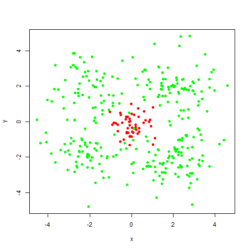
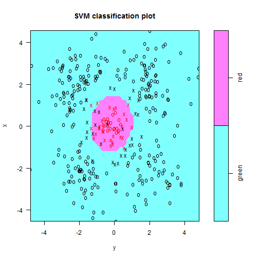
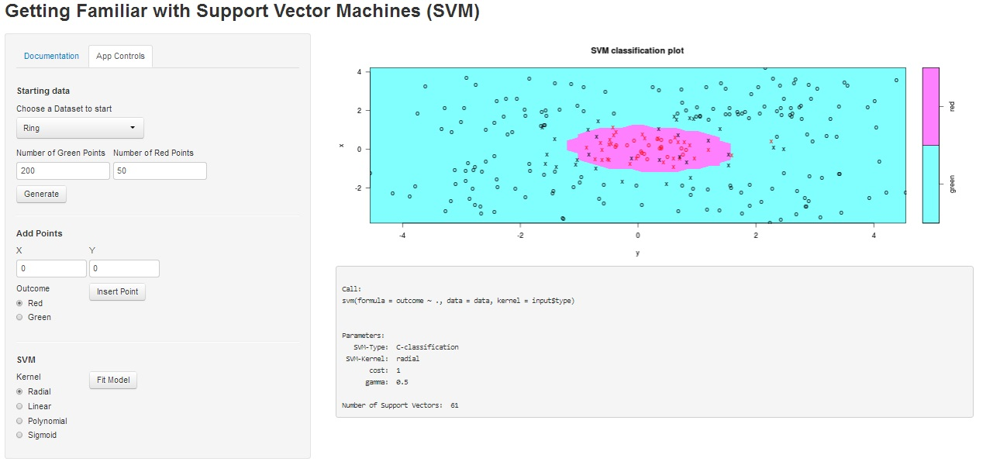

# An App to Get Familiar with SVMs. 
<h3>Assignment for the Data Products Course</h3> 
<h5>By: A. Zambrano (azambranog)</h5>

---

##  Motivation

1. Support Vector Machines are widely used for classification.
2. There are several types of support vector machines 
3. To start and get familiar with possible classification surfaces of SVM it is nice to practice in simple examples.
4. Use Shiny to create a simple app that can show SVMs in interesting training sets.

--- .class #id 

## Selecting and Plotting Sets

- Select between three interesting sets.
- Also possible to generate simple two points set and add points manually
- Plot the generated data


Function "dataring" is included to create a set with red points in the center and the app plots it


```r
data <- dataring(50, 300)
plot(data$x, data$y, col = as.character(data$outcome), pch = 19, xlab = 'x', ylab = "y")
```

 


--- .class #id 


## Modeling and Plotting 

- Select between different types of kernel for the SVM.
- When button is pressed a model is trained and automaticaly plotted

The code to fit and plot the SVM is

```r
library(e1071)
modFit <<- svm(outcome ~., data = data, kernel = "radial") 
plot(modFit,data)
```

 


--- .class #id 

## App Layout

The app can be found in [my shiny apps webpage](http://azambranog.shinyapps.io/SVMapp/)


